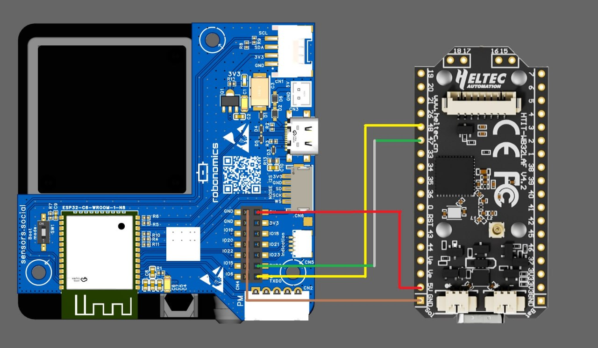

# Meshtastic IoT Bridge: Altruist Urban + Heltec + Raspberry Pi

## Обзор проекта

Тестовый стенд для передачи данных с датчика качества воздуха **Altruist Urban** (ESP32-C6) через **Heltec HTIT-WB32LA V4** по LoRa/Meshtastic на ноду **Raspberry Pi 4B + MeshAdv-Pi-Hat (E22-900M30S)**. Данные из удалённых локаций (без Wi-Fi/Internet) доставляются через mesh-сеть на ноду с интернетом и публикуются в локальный MQTT-брокер.

---

## Состав стенда

### Сетап 1: Передатчик (Remote / Field node)

| Компонент | Модель | Примечание |
|-----------|--------|------------|
| Датчик | Altruist Urban | ESP32-C6, SDS011, BME280, ICS43434 |
| LoRa-плата | Heltec HTIT-WB32LA V4 | SX1262, 868 MHz |
| Прошивка | Meshtastic 2.7.26.54e0d8d | HELTEC_V4 |
| ID ноды | `!b29f9cfc` | MAC: 80:f1:b2:9f:9c:fc |
| USB | `/dev/ttyACM0` | Espressif USB JTAG/serial debug unit (303a:1001) |

### Сетап 2: Приёмник (Gateway node)

| Компонент | Модель | Примечание |
|-----------|--------|------------|
| Одноплатник | Raspberry Pi 4B 4GB | Ubuntu 24.04 LTS (aarch64) |
| LoRa-модуль | MeshAdv-Pi-Hat E22-900M30S | SX1262, 30dBm |
| Прошивка | meshtasticd 2.7.26 | PORTDUINO |
| ID ноды | `!014c406b` | MAC: e4:5f:01:4c:40:6b |
| API | TCP `:4403` | Web UI `:80` |

---

## Подключение проводов

### Altruist Urban → Heltec (UART)

| Altruist Urban | → | Heltec GPIO | Примечание |
|----------------|---|---|-------------|
| TXD0 | → | GPIO 48 | Приём данных от Altruist |
| RXD0 | → | GPIO 47 | Отправка на Altruist (не используется) |
| GND | → | GND | Общая земля обязательна |



*Схема подключения: Altruist Urban (Robonomics) → Heltec HTIT-WB32LA V4*  
*Красный = GND, Жёлтый = TXD0→GPIO48, Зелёный = RXD0→GPIO47, Коричневый = 3.3V*

⚠️ **Важно**: Altruist Urban шлёт данные на 115200 baud непрерывными пакетами. Необходим общий GND.

### MeshAdv-Pi-Hat → Raspberry Pi 4B (GPIO)

| Pi GPIO | Назначение | Примечание |
|---------|-----------|------------|
| GPIO 21 | CS (SPI) | Chip Select |
| GPIO 16 | IRQ | Interrupt |
| GPIO 20 | Busy | SX1262 Busy pin |
| GPIO 18 | Reset | Hardware reset |
| GPIO 13 | TXen | TX enable |
| GPIO 12 | RXen | RX enable |

SPI использует стандартные пины: GPIO 10 (MOSI), GPIO 9 (MISO), GPIO 11 (SCK).

---

## Настройка ПО

### 1. Raspberry Pi (Gateway)

```bash
# Установка meshtasticd из официального PPA
sudo add-apt-repository ppa:meshtastic/beta
sudo apt update
sudo apt install meshtasticd

# Конфигурация LoRa-модуля /etc/meshtasticd/config.yaml
```

**`/etc/meshtasticd/config.yaml`:**

```yaml
Lora:
  Module: sx1262
  CS: 21
  IRQ: 16
  Busy: 20
  Reset: 18
  TXen: 13
  RXen: 12
  DIO3_TCXO_VOLTAGE: true

Webserver:
  Port: 80
```

```bash
# Права на VFS
sudo chown -R meshtasticd:meshtasticd /var/lib/meshtasticd/
sudo usermod -aG spi,gpio meshtasticd

# Запуск
sudo systemctl enable --now meshtasticd

# Проверка
meshtastic --host localhost --info
```

### 2. Настройка региона (EU_868)

```bash
meshtastic --host localhost --set lora.region EU_868
```

### 3. Heltec (Field node)

```bash
# Подключение через USB на Pi (или с компьютера)
meshtastic --port /dev/ttyACM0 --info

# Настройка Serial Module для приёма данных от Altruist
meshtastic --port /dev/ttyACM0 --set serial.enabled true
meshtastic --port /dev/ttyACM0 --set serial.mode 2        # TEXTMSG
meshtastic --port /dev/ttyACM0 --set serial.rxd 48         # Приём от Altruist TXD0
meshtastic --port /dev/ttyACM0 --set serial.txd 47         # Отправка на Altruist RXD0
meshtastic --port /dev/ttyACM0 --set serial.baud 11        # 115200 (enum value!)
meshtastic --port /dev/ttyACM0 --set serial.timeout 1      # 1 сек тишины = отправка
meshtastic --port /dev/ttyACM0 --set serial.echo true
```

⚠️ **Критически важно**: `baud` использует **enum-значения**, не числовые:
- `0` = Default
- `1` = 110
- `2` = 300
- ...
- `11` = **115200** ← нужно это

### 4. Проверка связи

Отправка теста с Heltec:
```bash
meshtastic --port /dev/ttyACM0 --sendtext "TEST"
```

Проверка на Pi:
```bash
sudo journalctl -u meshtasticd -f | grep "text msg"
```

Ожидаемый результат:
```
Received text msg from=0xb29f9cfc, msg=TEST
```

---

## Результаты экспериментов

### Связь Direct (Heltec ↔ Pi)

| Параметр | Значение |
|----------|----------|
| Расстояние | ~ indoor / same room |
| SNR | ~6.0 – 7.25 dB |
| RSSI | ~-2 … -20 dBm |
| Hops | 0 (Direct) |
| Частота | 869.525 MHz |
| Preset | LongFast (SF11, BW250) |
| TX Power | 27 dBm |

### Формат данных от Altruist Urban

Данные поступают через UART каждые 30–60 секунд в виде текстовых строк:

```
6a21dd03b0b2cabe61c0bc4c6033f7cfbe95d1128bea863d844837a83c46a6de...##
[extractRuntimeVersions] cache hit spec=42 tx=3#
67e1e9551465c8afe26421c844cc6c378e8085f9acc054c25138f18be9707f4f...##
```

- **Хекс-строки** с `##` на конце — подписи/хеши (SDS011/BME280 пакеты)
- **Текстовые метки** вида `[extractRuntimeVersions]` — runtime-логи
- **Бинарные символы** (`▒`) иногда присутствуют в потоке

### Двусторонняя связь

| Направление | Работает |
|-------------|----------|
| 406B → 9CFC | ✅ (текстовые сообщения) |
| 9CFC → 406B | ✅ (текст + serial данные) |
| 9CFC → 406B (через city mesh) | Требует общего channel URL |

---

## MQTT-интеграция

### Установка Mosquitto на Pi

```bash
sudo apt install mosquitto mosquitto-clients

# Создаём пользователя
sudo touch /etc/mosquitto/passwd
sudo mosquitto_passwd -b /etc/mosquitto/passwd mesh mesh123
sudo chown mosquitto:mosquitto /etc/mosquitto/passwd
sudo chmod 640 /etc/mosquitto/passwd

# Внешний listener /etc/mosquitto/conf.d/10-ext.conf
```

**`/etc/mosquitto/conf.d/10-ext.conf`:**
```
listener 1883 0.0.0.0
allow_anonymous false
password_file /etc/mosquitto/passwd
```

```bash
sudo systemctl restart mosquitto
```

### Meshtastic MQTT Module

**⚠️ Проблема**: Встроенный MQTT Module в `meshtasticd` (PORTDUINO) работает нестабильно — пакеты не публикуются, ошибки конфигурации `Unknown module config type 14/15/16`.

### Рабочее решение: Python Bridge (journalctl → MQTT)

```bash
pip install paho-mqtt
```

Скрипт слушает `journalctl -u meshtasticd`, парсит строки `Received text msg from=0xb29f9cfc` и публикует JSON в MQTT.

**Топики:**
- `altruist/b29f9cfc/text` — текстовые сообщения
- `altruist/b29f9cfc/raw` — нераспознанные данные

**Пример payload:**
```json
{
  "source": "0xb29f9cfc",
  "msg_id": "0x4d1099c6",
  "text": "6a21dd03b0b2cabe...##",
  "timestamp": 1785828186
}
```

---

## Известные проблемы

| Проблема | Причина | Решение |
|----------|---------|---------|
| Heltec не видит Altruist UART | `timeout=120`, данные идут постоянно | Установить `serial.timeout 1` |
| Heltec перезагружается при настройке | Запись в NVS занимает время | Ждать 5 сек между командами |
| Web UI пустой/крашится | meshtasticd Web UI V2.6.7 нестабилен | Использовать `journalctl` или Python API |
| meshtasticd MQTT не работает | PORTDUINO firmware limitation | Использовать Python bridge |
| Heltec mode сбрасывается на PROTO | Serial mode=4 (NMEA) по умолчанию | Принудительно установить `mode=2` |

---

## Дальнейшие шаги

1. **Интеграция в городскую mesh** — получить `Primary channel URL` от city admin и применить на обеих нодах
2. **Изоляция данных** — настроить приватный канал или использовать DM через Python-прокси
3. **Масштабирование** — добавить Pi Zero 2 W как UART-прокси на удалённой локации
4. **Home Assistant** — подписать HA на MQTT топики `altruist/#`

---

## Лицензия

MIT / Public Domain. Open Source проект на базе Meshtastic (GPL).
